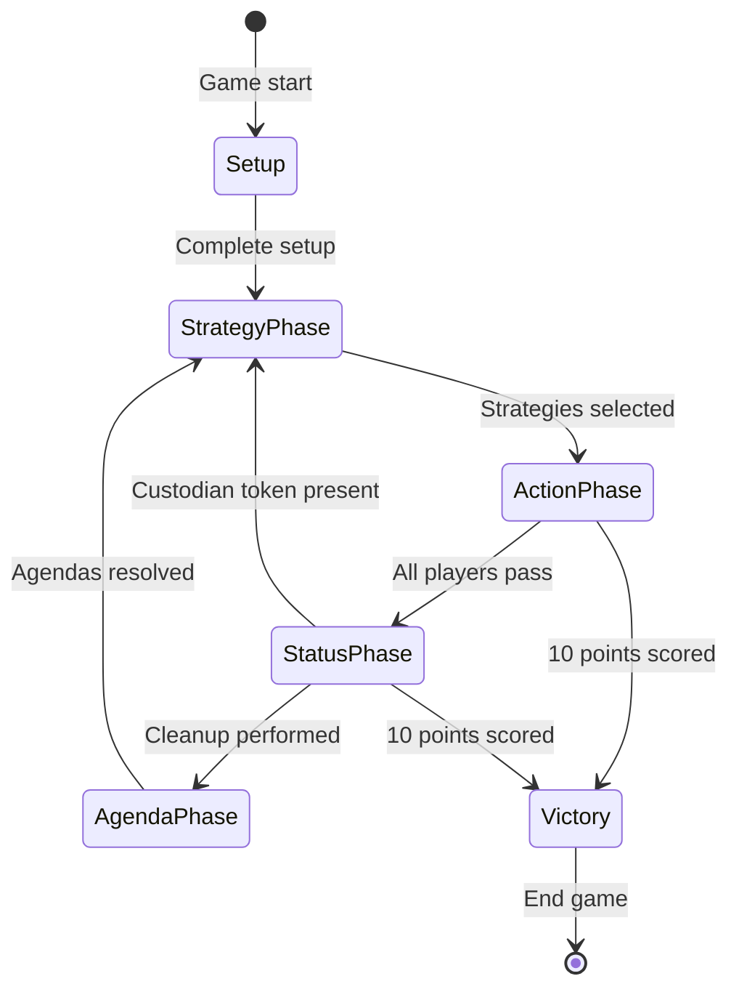
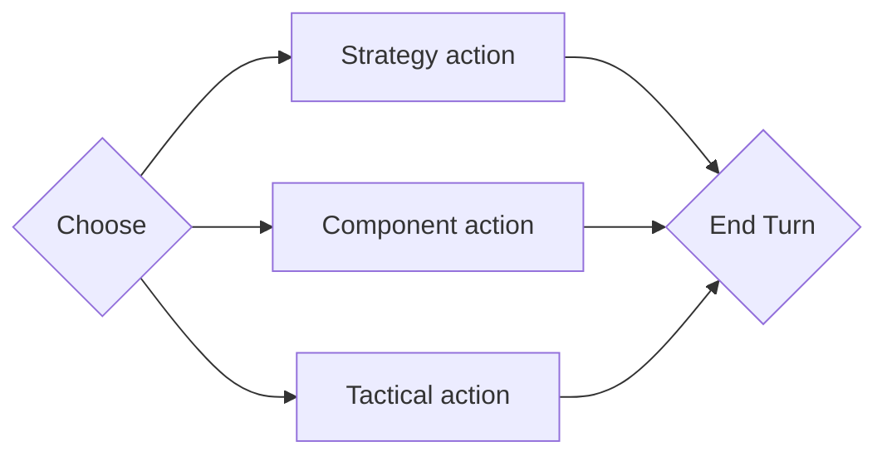

# Overview of rules

This is will show an overview of the rules of Twilight Imperium and how they relate to one another.

## Phases

The below chart shows the differnet states of the game.

### Strategy phase

### Action phase

The below state diagram shows one player's turn.

### Status phase

### Agenda phase

## References

https://images-cdn.fantasyflightgames.com/filer_public/51/55/51552c7f-c05c-445b-84bf-4b073456d008/ti10_pok_living_rules_reference_20_web.pdf

https://images-cdn.fantasyflightgames.com/filer_public/f3/c6/f3c66512-8e19-4f30-a0d4-d7d75701fd37/ti-k0289_learn_to_playcompressed.pdf
