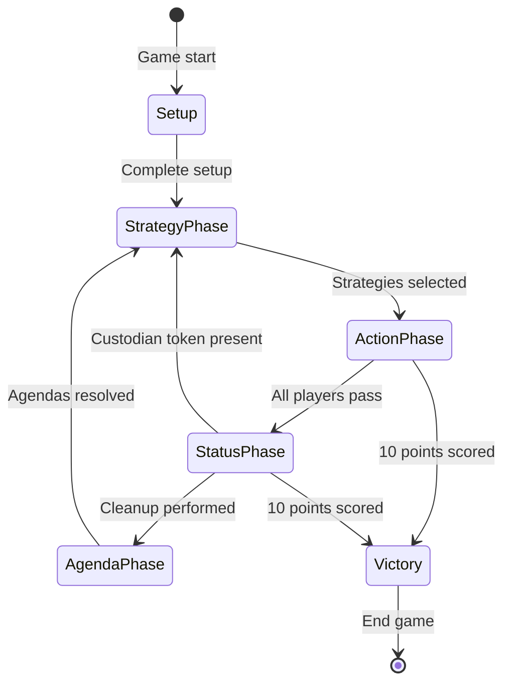
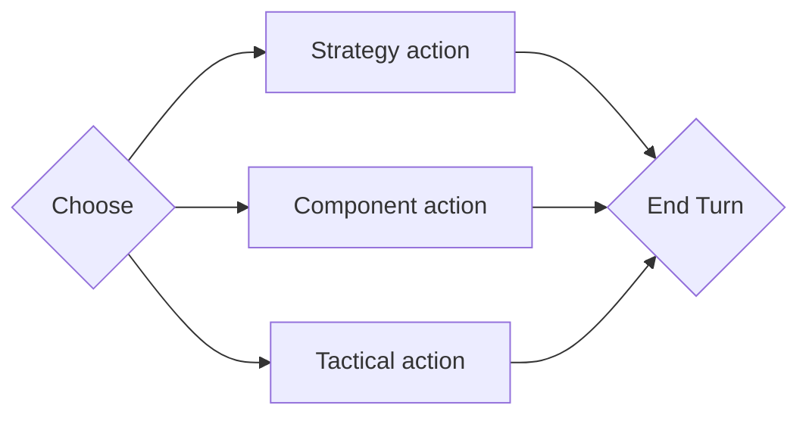

# Overview of rules

This is an overview of the rules of Twilight Imperium and how they relate to one another.

## Phases

The below chart shows the differnet states of the game.

### Strategy phase

### Action phase

The below state diagram shows one player's turn.

### Status phase

### Agenda phase

## Game Board

### Tiles

A tile represents an area of the galaxy. It can be either a system or a hyperplane.

#### System

A system tile is either a:

- Faction specific system (green)
- System with one or more planets (blue)
- System with no planets (red)
- Anomaly (red)

Any area on a system that is not a planet is space.

#### Hyperlane

A hyperlane tile is used to create adjacency between system tiles that are not touching each other. It is not a system.
It cannot have units on it or be the target of effect or abilities.

#### Anomaly

An anomaly is a system with special rules. There are four types:

- Asteroid field
- Nebulae
- Supernova
- Gravity rift

Some abilities can:

- cause a non-anomaly system tile to become an anomaly, it keeps its other properties.
- cause a system to be two different anomalies; it has the properties of both.

#### Activation

A system is activated when a player places a command token on it. A player cannot activate the same system twice. Other
players can activate the same system.

#### Adjacency

Two systems are adjacent if:

- Any sides are touching
- There is a matching wormhole on each one
- They are connected via a line on one or more hyperlane tiles

A system is not adjacent to itself.

#### Wormhole Nexus

The wormhole nexus is a tile where several wormholes converge. It begins in the game with its inactive side up. After a
player moves, places a unit into the wormhole nexus or gains control of the planet Mallice, they flip it to its active
side. When a ship moves in, the nexus becomes active at the end of the movement step.

The inactive side contains a gamma wormhole. The active side contains an alpha, beta and gamma wormhole.

This tile should be on the edge of the game board.

## References

- [Living Rules Reference](https://images-cdn.fantasyflightgames.com/filer_public/51/55/51552c7f-c05c-445b-84bf-4b073456d008/ti10_pok_living_rules_reference_20_web.pdf)
- [Learn to play booklet](https://images-cdn.fantasyflightgames.com/filer_public/f3/c6/f3c66512-8e19-4f30-a0d4-d7d75701fd37/ti-k0289_learn_to_playcompressed.pdf)
- [TI4 Map Generator](https://keeganw.github.io/)
- [Pictures of Tiles used in above map generator](https://github.com/KeeganW/ti4/tree/master/public/tiles)
